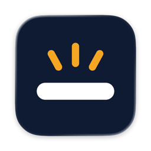
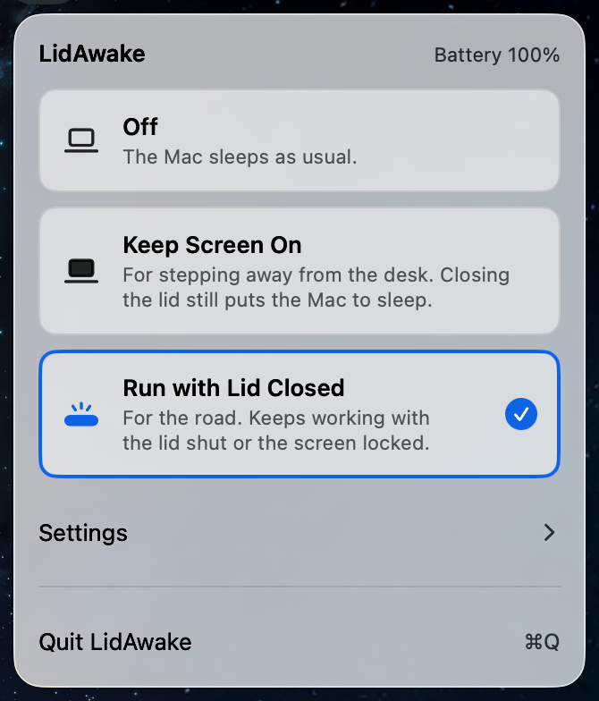
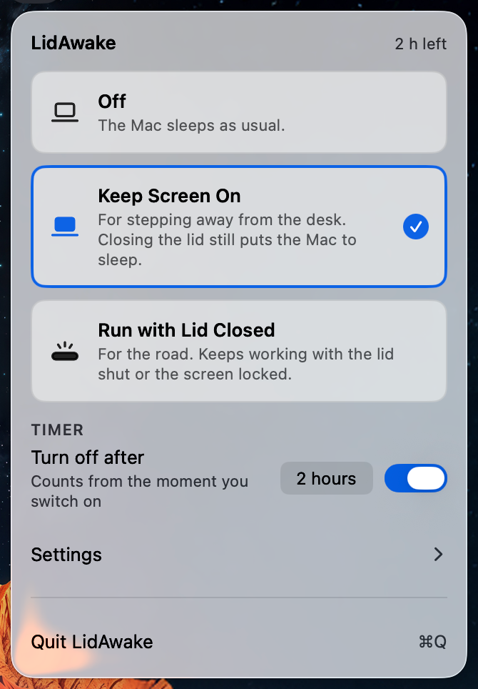
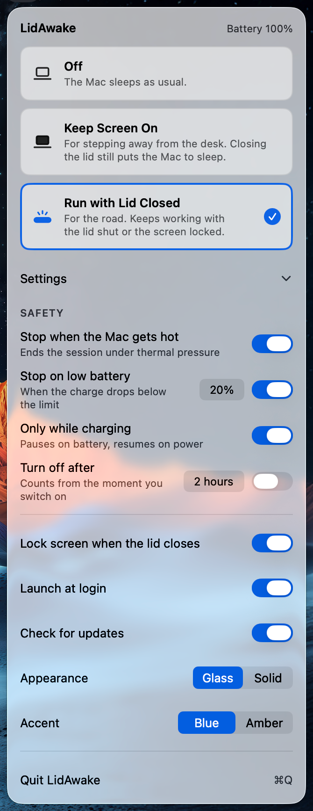
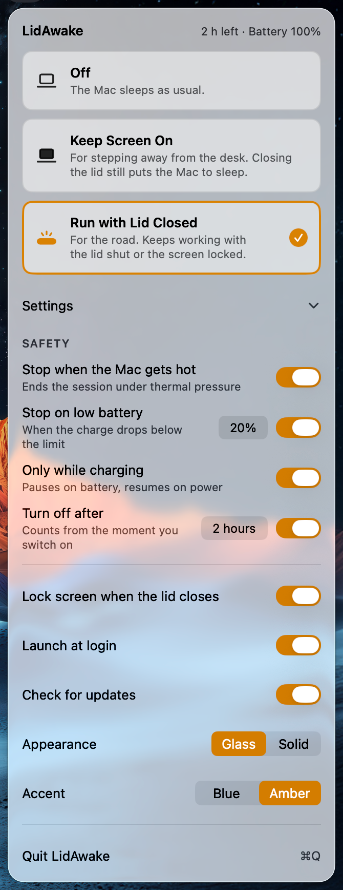

<p align="center">
  
</p>

<h1 align="center">LidAwake</h1>

<p align="center">A macOS menu bar app that keeps your Mac awake, even with the lid closed.</p>

<p align="center">macOS 13+ · Apple silicon · MIT</p>

<p align="center">
  
</p>

## Why LidAwake

- Keeps the Mac running with the lid closed; no external display is needed.
- Stops by itself when the Mac gets hot, when the battery runs low or when the timer ends, and can run only while charging.
- If the app quits unexpectedly or stops responding, normal sleep returns by itself within two minutes.
- Open source (MIT), no account and no analytics. The only network request is a daily update check, and it can be turned off.
- The interface is in English, German, Russian and Simplified Chinese.

LidAwake is an open-source alternative to apps like Amphetamine and to the `caffeinate` command for keeping a Mac awake, including with the lid closed and no external display.

## What it does

LidAwake keeps a Mac from sleeping in two situations: when you step away from the desk, and when the laptop is closed and travels with you. It lives in the menu bar, has no Dock icon, and offers one switch with three positions, so only one mode can be on at a time.

| | Off | Keep Screen On | Run with Lid Closed |
|---|---|---|---|
| For | normal use | stepping away from the desk | the road |
| Screen | as usual | stays on | may turn off and lock |
| Closing the lid | the Mac sleeps | the Mac sleeps | the Mac keeps running |
| Helper | not used | not used | required |
| Protections | none | timer only | all four |

<p align="center">
  <picture>
    <source media="(prefers-color-scheme: dark)" srcset="docs/images/window-dark.png">
    
  </picture>
  
</p>

## Protections

Each protection is turned on separately in Settings.

| Protection | What it does | Default |
|---|---|---|
| Stop when the Mac gets hot | Ends the mode when macOS reports the thermal state as serious or critical | on |
| Stop on low battery | Ends the mode when the Mac runs on battery and the charge is at or below the limit (10 to 50 %) | on, 20 % |
| Only while charging | Pauses the mode on battery power and resumes it when power is connected | off |
| Turn off after | Ends the mode after the chosen time (30 min to 8 hours), counted from the moment it was switched on | off, 2 hours |

The timer applies to both modes; the other three protections apply only to Run with Lid Closed.

In Run with Lid Closed, the protections and the timer run in the privileged helper, not in the app, so they keep working if the app crashes or stops responding. If the battery level, the power source or the thermal state cannot be read while the matching protection is on, the mode turns off.

When a protection ends or pauses the mode, LidAwake shows a notification and the reason in its window. If the app was not running when the mode ended, it shows the reason the next time it starts.

Lock screen when the lid closes (on by default) locks the screen as soon as the lid is closed in Run with Lid Closed. It uses a private macOS function; if a macOS version does not have it, the window says so.

<p align="center">
  
  
</p>

A closed laptop in a bag cools poorly. The protections reduce the risk; they do not remove it. The thermal protection reacts only to what macOS itself reports as overheating: in tests on a MacBook Air (M1) under full CPU load, the system reported a nominal thermal state throughout, so this protection has never been seen to trip.

## Automatic logout

macOS can log you out after a period of inactivity. The setting is in System Settings > Privacy & Security > Advanced… > Log out automatically after inactivity; the Advanced… button is at the bottom of Privacy & Security. Logging out quits all apps, LidAwake included, so the mode ends with the session. LidAwake only reads this setting; it does not change it or work around it.

When the setting is on and Keep Screen On or Run with Lid Closed is selected, the window shows macOS will log you out with the delay, the path to the switch and a button that opens the Advanced… window of Privacy & Security directly (on macOS 26; on other versions it may open Privacy & Security itself). The warning is not shown when Turn off after is on and set no longer than the logout delay, because the timer ends the mode first. The warning can be dismissed with its close button; it comes back only if the logout delay is set shorter than it was when dismissed. The setting is read again each time the window opens and whenever the mode changes.

To see what LidAwake reads:

```sh
/Applications/LidAwake.app/Contents/MacOS/LidAwake --auto-logout-status
```

It prints `auto-logout=` followed by the delay in seconds, or `auto-logout=off`.

## Install

1. Download the DMG from the [latest release](https://github.com/Vladimir-Podgornyi/LidAwake/releases/latest).
2. Drag LidAwake to Applications.
3. Open LidAwake from Applications. Its icon appears in the menu bar.

Or install it with [Homebrew](https://brew.sh):

```sh
brew install --cask vladimir-podgornyi/tap/lidawake
```

Then open LidAwake from Applications.

Launch at login is on by default and is set up on the first launch from Applications. After login the app starts in Off and does not turn a mode on by itself.

The first time you choose Run with Lid Closed, LidAwake registers its helper and asks you to allow it once in System Settings > General > Login Items & Extensions. No password is asked. The window has a button that opens that section. If you allow LidAwake within five minutes, the mode turns on by itself; otherwise choose Run with Lid Closed again. The helper is installed only when the app is in the Applications folder.

Requirements:

- macOS 13 or later.
- A Mac with Apple silicon. The app does not run on Intel Macs.

LidAwake is developed and tested on a MacBook Air (M1) with macOS 26. Older versions of macOS have not been tested. The Glass appearance is available only on macOS 26 and later.

## Updates

Once a day LidAwake sends one request to `api.github.com` for the number of the latest release. The request carries no data about you or your Mac; its User-Agent contains only the app version. Only the version number is read from the reply. If a newer version exists, the window shows Update available with a Download button that opens the releases page. A failed check is silent.

The check is turned off with the Check for updates toggle in Settings; when it is off, no requests are made. Updates are installed by hand: download the new DMG, choose Quit LidAwake, and drag LidAwake over the old copy in Applications. Finder does not replace the app while it is running.

If LidAwake was installed with Homebrew, update it with:

```sh
brew upgrade --cask lidawake
```

Homebrew quits LidAwake and unregisters its helper before replacing the app. LidAwake registers the helper again the next time you choose Run with Lid Closed.

LidAwake makes no other network requests and contains no analytics. The helper does not use the network.

## How it works

Run with Lid Closed sets the system flag `SleepDisabled` (`pmset -a disablesleep 1`). A privileged helper, a launchd daemon that runs as root, sets and clears it.

- **Lease.** The helper keeps the flag only while the app keeps renewing the session: the app renews every 30 seconds, and the lease lasts two minutes of awake time. If the renewals stop, the helper clears the flag and normal sleep returns. Quitting LidAwake turns the mode off first.
- **Leftovers.** The system starts the helper at boot and after a crash. On start it clears a flag that it set earlier and, if that fails, retries every 30 seconds. With nothing to do it exits after two minutes. When the app starts, it also ends a session left over from its previous run.
- **Signature check.** The helper accepts connections only from LidAwake signed with the developer's Developer ID, and the app talks only to a helper signed the same way. Another program cannot change the flag through the helper.
- **Someone else's flag.** If `SleepDisabled` was set by another program, LidAwake does not clear it. The helper records the flags it sets in `/Library/Application Support/com.vladimirpodgornyi.LidAwake`. If the other program clears its flag during a LidAwake session, the helper sets the flag again and treats it as its own.

Keep Screen On does not use the helper. It holds a power assertion that prevents idle display sleep, as `caffeinate -d` does.

## If the Mac does not sleep

Check the flag:

```sh
pmset -g | grep SleepDisabled
```

`SleepDisabled 1` means sleep is disabled. `SleepDisabled 0` or no such line means it is not.

To clear the flag by hand, first set LidAwake to Off or quit it, otherwise the helper sets the flag again on the next renewal. Then run:

```sh
sudo pmset -a disablesleep 0
```

This also clears a flag that another program has set.

## Uninstall

If LidAwake was installed with Homebrew, first turn off Launch at login in Settings, then run:

```sh
brew uninstall --cask lidawake
```

This quits LidAwake, which turns the mode off, runs `LidAwake --uninstall-helper` to unregister the helper, and removes LidAwake from Applications. With `--zap` it also moves the settings file `~/Library/Preferences/com.vladimirpodgornyi.LidAwake.plist` to the Trash. The helper's folder in `/Library/Application Support` is left in place; remove it with the `sudo rm` command in step 5 below.

Without Homebrew:

The helper's launchd job is registered from inside the app bundle, so remove it before deleting the app.

1. In the LidAwake window, choose Off, open Settings and turn off Launch at login.
2. Choose Quit LidAwake.
3. Unregister the helper:

   ```sh
   /Applications/LidAwake.app/Contents/MacOS/LidAwake --uninstall-helper
   ```

   The command prints the helper state and exits.
4. Move LidAwake from Applications to the Trash.
5. Optionally, remove the settings and the helper's folder:

   ```sh
   defaults delete com.vladimirpodgornyi.LidAwake
   sudo rm -r "/Library/Application Support/com.vladimirpodgornyi.LidAwake"
   ```

## Build from source

You need macOS and Xcode; the scripts call `swift build`, `xcrun actool` and `codesign`. The project is a Swift package without an Xcode project file.

```sh
scripts/build-app.sh                # builds build/LidAwake.app
ARCH=x86_64 scripts/build-app.sh    # builds an Intel app in build/x86_64/LidAwake.app
scripts/install-app.sh              # quits a running LidAwake and copies the app to /Applications
scripts/check-localizations.sh      # checks that every interface string exists in all four languages
```

`build-app.sh` signs with a Developer ID Application certificate of team `ZW984867UC` from the keychain, or with the identity in `SIGN_IDENTITY`. Without such a certificate it signs ad hoc and prints a warning that the privileged helper will not work in this build. The app and the helper accept each other only with a Developer ID signature of that team. Run with Lid Closed has not been tested in a build signed any other way.

`build-app.sh` builds for Apple silicon (`ARCH=arm64`, the default) or for Intel (`ARCH=x86_64`), never both in one app, and stops if a binary has another architecture.

`scripts/release.sh` builds, notarizes and packs the DMG for a release; with `ARCH=x86_64` it makes `LidAwake-<version>-intel.dmg`. It needs the Developer ID certificate of that team and a `notarytool` keychain profile.

## Languages

The interface is in English, German, Russian and Simplified Chinese. The language follows the system settings. To use Simplified Chinese for this app only, choose LidAwake in System Settings > General > Language & Region > Applications and select Simplified Chinese.

## License

[MIT](LICENSE)
